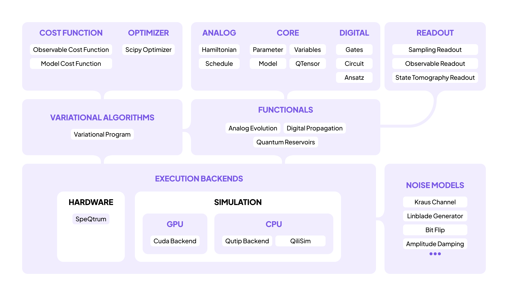
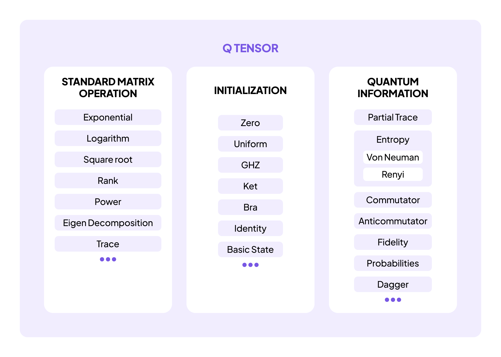
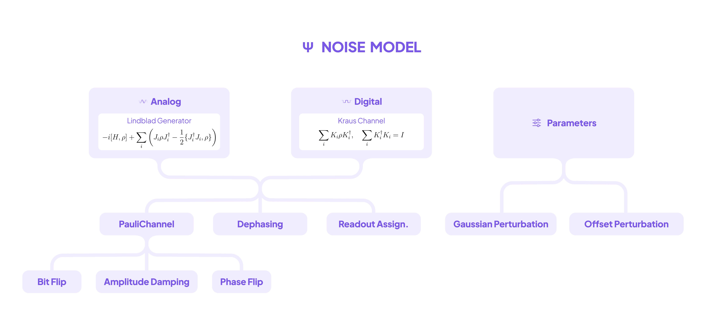
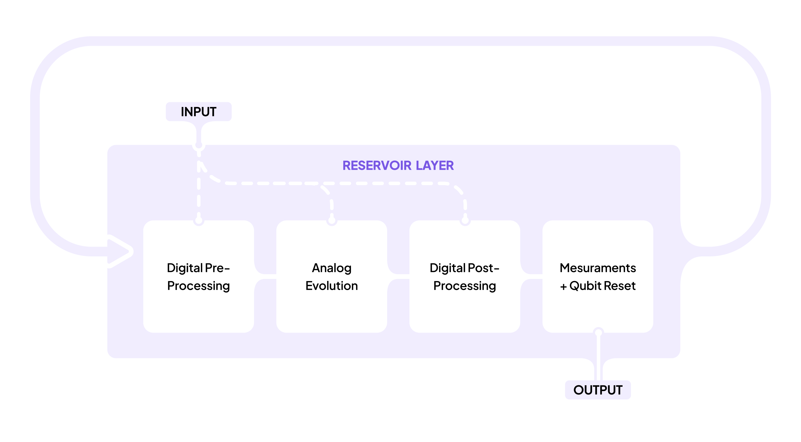

<!-- _class: lead -->
<!-- _paginate: false -->
<!-- _footer: '' -->

# Learn Quantum Computing with QiliSDK

From Circuits to Pulse-Level Control

EuroPython 2026 · hands-on tutorial (about 3 h) No quantum background required, bring Python

---

## Why quantum computing?

- **Simulating molecules & materials.** Nature runs on quantum mechanics, and describing $n$ interacting quantum particles classically takes $2^n$ numbers. That overwhelms classical RAM fast; a quantum computer *is* such a system.
- **Combinatorial optimization** (scheduling, routing, portfolios): encode the problem as an **energy landscape** and let physics settle into the minimum.
- **Machine learning features & sampling**: quantum dynamics is a rich, hard-to-simulate feature map.
- **And a day-one bonus**: true randomness straight from physics, not from a pseudo-random algorithm.

---

## Quantum computing in 2026, honestly

- **It will not**: speed up Django, give a generic "everything runs faster" boost, or hold big data (100 qubits do not load your database).
- **Devices today**: noisy, small, expensive, but real, running, and improving every year.
- **So the smart way in**: a simulator on your laptop is exact and free at learning scale, with none of the queueing.
- **And QiliSDK's swappable backends** mean today's code retargets to real hardware unchanged. Parts 5 and 6 make both points concrete.

---

## What you'll walk away with

- A working **mental model**: qubits, measurement, gates, Hamiltonians, noise.
- Programs you built yourself: a **quantum random number generator** and a **conference schedule** found by annealing.
- Real workflows at toy size: a **molecule's ground-state energy** and a **microservice fleet placed** across servers.
- Engineering honesty: a **noise budget** for the chemistry result and a **circuit compiled** onto a real chip layout.

---

## Your mission today

One thread runs through the whole day:

- **Learn the rules** of the quantum world (Parts 1 and 2) and build your first real program: a **quantum dice roller**.
- **Schedule conference talks** with a quantum annealer (Part 3).
- **Compute a molecule's energy** and **split microservices across servers** (Part 4).
- **Find how much noise those answers survive** (Part 5), then **compile and retarget them** toward a real chip (Part 6).

---

## Schedule

| Part | Topic | Time |
|------|-------|------|
| 1 | Foundations: qubits, states, measurement | 30 min |
| 2 | Circuits / Digital Quantum Computing | 30 min |
| 3 | Hamiltonians & Analog Quantum Computing | 35 min |
| - | *break* | 15 min |
| 4 | Variational Algorithms & Optimization Models | 40 min |
| 5 | Noise & Realistic Execution | 20 min |
| 6 | Execution & Toward Hardware | 30 min |

About 3 hours in total. Times are approximate, we flex with the room.

---

## Follow along

**Two ways to run everything, pick one:**

- **Local**: `pip install -r setup/requirements.txt` (Python 3.11–3.13), then open the notebooks.
- **Colab**: every notebook's first cell installs QiliSDK (pinned to `0.2.0`) automatically. Zero local setup.

**Right now:** open and run `notebooks/00_setup.ipynb`.
If its last cell prints counts like `{'00': ~500, '11': ~500}`, you're ready. ✅

> QiliSDK ships its C++ simulator **QiliSim** *inside* the wheel: nothing to compile.

---

## The architecture

Primitives → Workflows → Execution. <strong>The same program runs on a CPU, a GPU, or a quantum processing unit (QPU) by changing one line: the backend.</strong>

---

## How we'll work

- **Coding-first.** These slides are a map; the real work is in the notebooks.
- Each part: a short **concept**, a live **code-along**, then **1 or 2 🧩 exercises**, each a small real problem.
- Notebooks come in two flavors:
  - `notebooks/…`: **attendee** version (blank `# TODO` cells)
  - `notebooks/solutions/…`: **completed**, with outputs
- Every snippet is **verified to run** against `qilisdk 0.2.0`.

> Stuck on an exercise? The solution is one folder away, but try first. 🙂

---

## 30 seconds of notation

Quantum papers use **bra-ket** syntax: typed labels around vectors you already know from numpy.

- A **ket** $|\psi\rangle$ (read "ket psi") is a labeled complex **column vector**: $|0\rangle$ is `np.array([[1], [0]])`.
- A **bra** $\langle\psi|$ is its **conjugate transpose**, a row vector: `psi.conj().T`.
- The sandwich $\langle\psi|O|\psi\rangle$, where $O$ is an observable (a matrix), is `row @ matrix @ column`: **one number**, the average measurement outcome.

That is every symbol today's math needs.

---

<!-- _class: divider -->

Part 1 · 30 min · notebooks/01_foundations.ipynb

# Foundations

### Qubits, randomness you can trust, and why eavesdroppers get caught

---

## Part 1: the ideas, in plain words

- A **qubit** is two complex numbers, its **amplitudes**: one weight for `0`, one for `1`. Think `np.array([a, b])` with unit length.
- **Measuring** samples one outcome with probability $|\text{amplitude}|^2$ (the **Born rule**) and destroys the superposition. No peeking twice.
- $n$ qubits need $2^n$ amplitudes. That **memory wall** is why Feynman proposed quantum computers in the first place.
- But measurement returns only $n$ classical bits, so algorithms must **choreograph interference**: wrong answers cancel, the right one survives.

---

## Part 1: the vocabulary and the API

- **Superposition**: several amplitudes nonzero at once. **Phase**: an amplitude's sign or angle, invisible on its own, decisive when paths interfere.
- **Observable**: a measurable quantity written as a matrix. Its **expectation value** is the long-run average of measuring it.
- **Entanglement**: correlated randomness between qubits that nobody else holds a copy of (the eavesdropper-catching ingredient).
- In code: `QTensor` holds states *and* operators. You will meet `ket`, `.probabilities()`, `expect_val`, and `partial_trace`.

---

## `QTensor`: the math object behind it all

Standard matrix ops · state factories (<code>ket</code>, <code>ghz</code>, <code>uniform</code>, …) · quantum-information primitives (partial trace, entropy, fidelity).

---

<!-- _class: divider -->

Part 2 · 30 min · notebooks/02_circuits.ipynb

# Circuits & Digital Quantum Computing

### Your first real program: a quantum dice roller

---

## Part 2: the ideas, in plain words

- **Gates** are reversible matrix operations on the amplitude vector: the Hadamard gate $H$ creates superposition, the controlled-NOT (**CNOT**) entangles two qubits.
- A **circuit** is a program: an ordered list of gates applied to a fresh register of qubits.
- **Measurement** ends the program and hands back plain classical bits.
- **Sampling** with finite shots shows Monte Carlo noise around the **exact** distribution; a simulator can hand you either one.

---

## Part 2: the one execution pattern

$$\texttt{Backend.execute(functional, readout)} \rightarrow \texttt{Result}$$

- **Functional** = *what* to run: `DigitalPropagation(circuit)` wraps your circuit.
- **Backend** = *where* to run: `QiliSim`, the built-in simulator. **Readout** = *what to measure*: samples, expectation values, or the exact state.
- A bare `Circuit` never executes. The wrapper keeps *what* cleanly separate from *where*.
- **The day's thesis**: the same program runs on a CPU, a GPU, or a QPU by changing one line. Part 6 pays it off.

---

<!-- _class: divider -->

Part 3 · 35 min · notebooks/03_analog.ipynb

# Hamiltonians & Analog Quantum Computing

### Schedule conference talks by cooling a quantum system

---

## Part 3: the ideas, in plain words

- A **Hamiltonian** is a system's energy function. For us today: a **cost function over bitstrings**, where lower energy means a better solution.
- The lowest-energy configuration, the **ground state**, *is* the answer.
- **Annealing**: start in an easy landscape whose minimum you know, morph it slowly into the hard one, and arrive still sitting in the minimum. The morph speed is a real knob you will turn.
- The analogy to keep: **physics is the optimizer**. You only design what "low energy" means.

---

## Part 3: the vocabulary and the API

- **Pauli operators** ($X$, $Z$, …) are the matrix building blocks; weighted sums of their products express every cost function we need today.
- An **Ising model** is a Hamiltonian of $Z$ terms: each qubit acts as a **spin**, a tiny magnet pointing up or down, mapping to 0 or 1.
- The **adiabatic theorem** is the guarantee: morph slowly enough and the system stays in its ground state throughout.
- In code: `Hamiltonian` algebra like `Z(0)*Z(1)`, `Schedule.linear` for the morph, `AnalogEvolution` to run it.

---

<!-- _class: divider -->
<!-- _footer: '' -->

# ☕ Break: 15 min

### Next: a molecule's energy, and a quantum compiler for your optimization problems.

---

<!-- _class: divider -->

Part 4 · 40 min · notebooks/04_variational.ipynb

# Variational Algorithms & Optimization Models

### Compute what chemists compute, and place microservices with a quantum optimizer

---

## Part 4: the variational loop

- It *is* a machine learning training loop: the **ansatz** (a parameterized circuit) is the model, **energy** is the loss, **SciPy** is the optimizer.
- The **Variational Quantum Eigensolver (VQE)** tunes the circuit parameters to minimize the measured energy.
- The variational principle: the average energy never dips below the true ground-state energy, so pushing it down approaches the real answer.
- VQE measured the **hydrogen molecule's energy on real hardware in 2016**. Today you reproduce that calculation.

---

## Part 4: from Python problem to physics

- **Quadratic Unconstrained Binary Optimization (QUBO)**: your problem as binary variables and an objective, with constraints folded in as penalties.
- The pipeline: `Model` → `to_qubo()` → `to_hamiltonian()`. Declare in Python, compile to an Ising Hamiltonian.
- The **Quantum Approximate Optimization Algorithm (QAOA)** solves that same Hamiltonian with a gate circuit: a parameterized, trainable anneal.
- Today's instance: place **4 microservices on 2 servers**, balanced, minimizing cross-server traffic.

---

<!-- _class: divider -->

Part 5 · 20 min · notebooks/05_noise.ipynb

# Noise & Realistic Execution

### Why real answers come out blurry, and the gate-fidelity budget chemistry demands

---

## Part 5: the ideas

- Noise turns pure states into **mixtures**. A **density matrix** describes one: a probability-weighted mixture of states, like a dict of state to probability.
- Channels have developer analogies: **bit flips** (random data corruption), **amplitude damping** (energy leaks away like a leaky capacitor, timescale $T_1$), **readout error** (a flaky sensor).
- **Ideal vs noisy is one argument**: `QiliSim(noise_model=nm)`. Same functional, same readout.
- The payoff experiment: **how much gate error** can the hydrogen result absorb before it stops being chemistry?

---

## The noise framework

One <code>NoiseModel</code>, two mathematical engines: <strong>Lindblad</strong> generators for analog evolution, <strong>Kraus</strong> operators for digital circuits, plus parameter perturbations.

---

<!-- _class: divider -->

Part 6 · 30 min · notebooks/06_execution_and_hardware.ipynb

# Execution & Toward Hardware

### Same code, laptop to QPU: swap, export, compile

---

## Part 6: swap, export, compile

- **Swapping the backend** is like swapping a database driver, or moving numpy code to CuPy: one line, same program.
- **Open Quantum Assembly (OpenQASM)** is the interchange format, like JSON for circuits. **Quantum Intermediate Representation (QIR)** is the bytecode.
- The **transpiler is a compiler**: instruction selection (your gates → the chip's native set) plus register allocation (your qubits → physical qubits).
- **SABRE** (SWAP-based Bidirectional heuristic search), a routing pass used by production compilers, makes every two-qubit gate land on physically connected qubits.

---

## Part 6: the honest pulse story

- QiliSDK 0.2.0 ships **no pulse or waveform API**. We will not pretend otherwise.
- The closest real thing is the analog **`Schedule`**: continuous, time-dependent **Hamiltonian-level control**, not waveforms on physical channels.
- Genuine pulse experiments (Rabi calibration, $T_1$ measurement) run on real devices through **SpeQtrum**: a remote job queue, not a local backend.
- The mental model survives the trip to hardware: describe *what to run*, submit it, read the results.

---

## Capstone: Quantum Reservoir Computing

A **fixed** quantum system acts as a feature extractor: inputs go in, expectation values come out, and only a **linear numpy model** is trained on top. No gradients through the quantum part. Today it forecasts a **noisy sensor signal**.

---

## The journey

**Dice roller** → **talk schedule** → **molecule energy & service placement** → **noise budget** → **compiled circuit** → **sensor forecast**

A small set of primitives, composed and executed uniformly:

`QTensor` · `Circuit` · `Hamiltonian` · `Schedule` · `Readout`
 → wrapped in **Functionals** → run by a swappable **Backend**.

> **The one line that did it all:** `backend.execute(functional, readout)`.

---

<!-- _class: lead -->
<!-- _footer: '' -->

# Thank you! 🙏

Questions? And where to go next:

Docs (EN / ES / CA): <strong>qilimanjaro-tech.github.io/qilisdk</strong> · Source: <strong>github.com/qilimanjaro-tech/qilisdk</strong> 
Diagnostics: <code>print(qilisdk.about())</code> · Install: <code>pip install qilisdk==0.2.0</code> 
Real hardware access: <strong>SpeQtrum</strong> and cloud QPUs run the same functional + readout you wrote today 
Rerun the notebooks bigger: more talks, more services, tighter noise budgets

